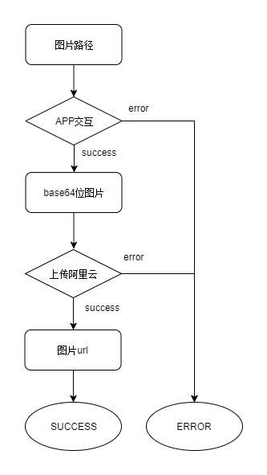

# 常兴APP离线图片上传总结

## 背景
常兴APP业务上需要在离线状态下添加和预览图片，有网时再上传图片。之前是添加后直接上传，所以需要探索离线上传方案。

## 思路
添加时存储本地路径，预览时根据本地路径获取base64位图片，最终上传时通过本地路径获取到base64位，然后直接上传到阿里云，将图片链接存储云端。

## 流程图

一张图片从本地路径path转成链接url过程：



多张图片上传：


## 实现

### 添加图片

* 调用`Matrix.takePhoto(key, num)`获取手机图片，key为图片标识，num为最多可选择图片数量
* 监听`photo`事件获取到对应的key值、本地路径path和base64位

### 预览图片

* 调用`Matrix.getPhoto(key, path)`方法将图片path转成base64
* 监听`getPhoto`事件获取到对应的key值、本地路径path和base64位

### 上传图片

1. 配置阿里云服务信息

```js
let oss = new OSS({
  region: '******',
  accessKeyId: '******',
  accessKeySecret: '******',
  bucket: '******'
})
Vue.prototype.$oss = oss
```

2. 将base64位转成文件流

```js
base64ToBlob (base64) {
  const bytes = window.atob(base64)
  const ia = new Uint8Array(bytes.length)
  for (let i = 0; i < bytes.length; i++) {
    ia[i] = bytes.charCodeAt(i)
  }
  return new Blob([ia], { type: 'image/png' })
}
```

3. 上传

```js
this.$oss.multipartUpload(imgUrl, file)
  .then(() => {
    console.log('上传成功')
  })
  .catch(err => {
    console.log('上传失败', err)
  })
```

imgUrl为文件上传路径，上传之前先定好文件上传路径规则，避免混乱。

> 常兴图片存储路径规则为: /inspect/{api}/{userNo}/{formKey}/{checkNo}/{文件名}

### 多图并发

```js
getImgUrlList (formKey, list) {
  return parallelToSerial(list, ([ parent ]) => {
    let key = formKey + '/' + parent.checkNo
    const imgPathList = parent.imgPathList
    const imgUrlList = parent.imgUrlList

    // 以5张一次的速度并发
    return parallelToSerial(imgPathList, images => {
      const uploadList = images.map(path => {
        const req = this.getPhotoFromPath(path, key)
        req.then(url => {
          imgUrlList.push(url)
        })
        return req
      })
      return Promise.all(uploadList)
    }, 5)
  })
}
```