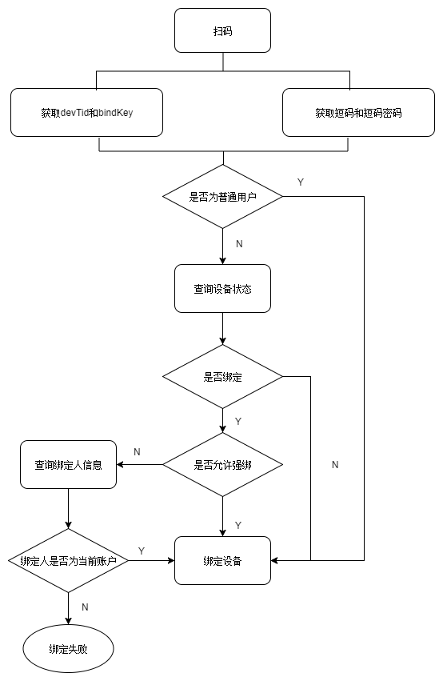

# 消防行业APP开发文档

> 消防类行业APP开发总结，目前有海水湾APP、电可安APP(金控)、智慧用电APP(中科城安)

## 环境搭建

``` bash
# 安装依赖
npm install

# 启动本地服务（默认test环境接口） localhost:8080
npm run dev

# 使用杭州环境本地调试
npm run dev:hz

# 使用线上环境本地调试
npm run dev:prod

# 打包杭州环境
npm run build:hz

# 打包test环境
npm run build:test

# 打包线上环境
npm run build:prod
```

## 目录结构

```bash
src
├─ api               # api接口，按功能模块划分
│    ├─ server       # 接口域名配置，环境有杭州环境、测试环境、线上环境
│    ├─ device.js
│    ├─ login.js
│    └─ ...
├─ assets            # 静态资源文件夹
│    ├─ iconfont     # 字体图标
│    ├─ images       # 图片
│    ├─ stylus       # 样式
│    └─ utils        # js脚本
├─ components        # 组件
├─ main.js           # 主要配置入口
├─ permission.js     # 权限管理
├─ router.js         # 路由
├─ store             # VUEX
├─ App.vue           # APP入口文件
└─ views             # 各功能页面
       ├─ add        # 扫码绑定成功或失败页面
       ├─ device     # 设备详情控制页面
       ├─ login      # 登陆、注册、忘记密码页面
       ├─ message    # 消息中心页面
       ├─ user       # 个人中心页面
       └─ home       # 首页等等
```

## 样式管理

```bash
stylus
├─ hekr.scss             # 自定义公共样式
└─ color.scss            # 颜色变量
```

### 命名规范

* 自定义公共样式，统一使用`hekr-`命名
* 自定义颜色变量，统一使用`$--hc-`命名

## 项目备注

### pid说明

* 每个行业项目根据pid区分，pid从console上获取。
* 目前海水湾测试环境和正式环境pid不同，注意区分。金控和中科城安线上和测试账号和pid相同。
* 以后项目尽量保证测试环境和正式环境console账号和pid相同。
* pid在`src/store/state.js`中配置。

```bash
# 海水湾线上账号
console: 18066313344
pid: 01253583638

# 海水湾测试账号
console: 15158854335
pid: 01376787549

# 金控线上和测试账号
console: 13736732828
pid: 01998843645

# 中科城安线上和测试账号
console: 1757566751@qq.com
pid: 01316026796
```

### 下载链接

APP名称 | 安卓测试 | iOS测试 | 安卓线上 | iOS线上
- | - | - | - | - 
海水湾 | [LMZb](https://www.pgyer.com/LMZb) | [dQsc](https://www.pgyer.com/dQsc) | [m33a](https://www.pgyer.com/m33a) | [M8xh](https://www.pgyer.com/M8xh)
电可安 | [Y7Dq](https://www.pgyer.com/Y7Dq) | [ixSF](https://www.pgyer.com/ixSF) | [hLmo](https://www.pgyer.com/hLmo) | [Uy9c](https://www.pgyer.com/Uy9c)
中科城安 | [ZgVE](https://www.pgyer.com/ZgVE) | [ErI4](https://www.pgyer.com/ErI4) | [ZKE0](https://www.pgyer.com/ZKE0) | [3IRE](https://www.pgyer.com/3IRE)

### 权限说明

APP主要用到下列四个权限：

1. `device$operation`: 设备操作权限，包括扫码绑定设备和修改设备信息。无权限对页面影响：首页无扫码图标，设备详情页无编辑图标。
2. `device$control`: 设备控制权限。无权对页面影响：控制页控制按钮隐藏。
3. `device$delete`: 设备删除权限。无权对页面影响：首页列表不能左滑。
4. `warning$handle`: 告警处理权限。无权对页面影响：告警和故障消息页面无处理按钮。

### 用户类型说明

* 用户分为普通用户和后台分配账号。
* 普通用户是在APP上注册的用户，后台分配账号由管理后台分配产生。
* 根据用户信息中是否由`enterprise`字段来区分。

### 用户Token说明

* 用户登陆token使用`localstrage`存储，`access_token`24小时过期，`refresh_token`30天过期。
* app用户不手动退出，打开app都要保持登陆状态。
* 存储的key值在`src/store/state.js`里修改，注意每个项目key值修改一下。

### Matrix说明

* `src/assets/utils/matrix.js`文件是在开发环境中使用，模拟调用APP接口方法。
* 打包之后可通过`window.Matrix`获取APP方法。

### 缓存信息说明

* 用户登陆token信息。
* 安装位置和所属地址信息。绑定设备成功页面会从获取上一次绑定设备的安装位置和所属地址。
* clientId信息。一旦获取到clientId就存储起来，下次打开app的时候先从缓存读取绑定。
* 缓存的key值统一在`src/store/state.js`中修改。

## 原生APP交互

### 安卓返回键

* 安卓返回的时候会调用一次 `Matrix.back()` 方法。 
* 最初back方法是个空函数，可以在`APP.vue`中重置back方法。

### 设置状态栏颜色

* 使用 `Matrix.setStatusBarColor(color)` 设置状态栏颜色。
* 最初启动页时候的状态栏是app默认的，如果要修改需要app配合。

### 获取clientId

* APP收到推送消息需要绑定当前clientId, 退出登陆后要解绑。
* `Matrix.getClientId()` 会返回当前clientId, 但一般情况在`app.vue`中还获取不到clientId, 需要监听 `getClientId`事件。

### 接收消息推送

* 监听 `onNotification` 事件获取消息内容。
* 消息类型目前使用的有：强绑（`DEVICE_FORCEBIND`）、告警故障（`DEVICE_ALERT`）、系统消息。
* 目前处理方式是：除了强绑消息弹框展示被绑定信息外，其他消息都确认跳转到消息中心页面。
* 开发环境中可以使用 `Matrix.sendMessage(type)` 模拟发送消息。

### 收到消息声音提示

* 收到消息通知的时候可以使用 `Matrix.alert()` 添加提示声音。
* 目前只有金控APP使用声音。

### 扫码二维码

* 通过 `Matrix.scanQRCode(key)` 调用扫描二维码。
* 通过监听 `qrcode` 获取扫描结果。

### 获取手机图片

* 通过 `Matrix.takePhoto(key, max)` 获取手机图片，max为最多可选几张图片。
* 通过监听 `photo` 获取图片信息。

## 功能逻辑讲解

### 注册功能

APP仅支持手机号注册，具体接口文档阅读[注册接口](http://docs.hekr.me/v4/云端API/登录注册/#手机注册)

### 扫码绑定

* 绑定类型分为两类：一是根据devTid和bindKey绑定，二是根据短码和短码密码进行绑定。根据二维码返回的结果来区分。
* 绑定根据用户类型有所区分：普通用户获取到信息后直接绑定，后台分配账号先查询设备状态再进行绑定。

绑定逻辑见下图



### 消息推送

* 打开APP先从缓存读取clientId, 如果缓存没有，通过`Matrix.getClientId()`获取，全局监听 `getClientId` 事件获取app传过来的clientId进行绑定。
* 推送类型有：个推（GETUI)、小米（XIAOMI）、华为（HUAWEI）
* 手动退出及时解绑。

### webSocket连接

* 使用web版sdk建立连接通信，创建方法：`new HS.Matrix()`，项目中在 `src/permissions.js` 创建。
* 进入不同设备页面使用 `setToken` 方法更新控制token。
* 使用 `new HS.Hekr()` 创建Hekr，需要传入 `devTid` 和 `Matrix` 对象。
